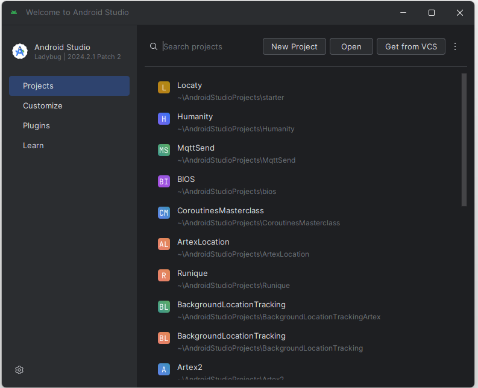
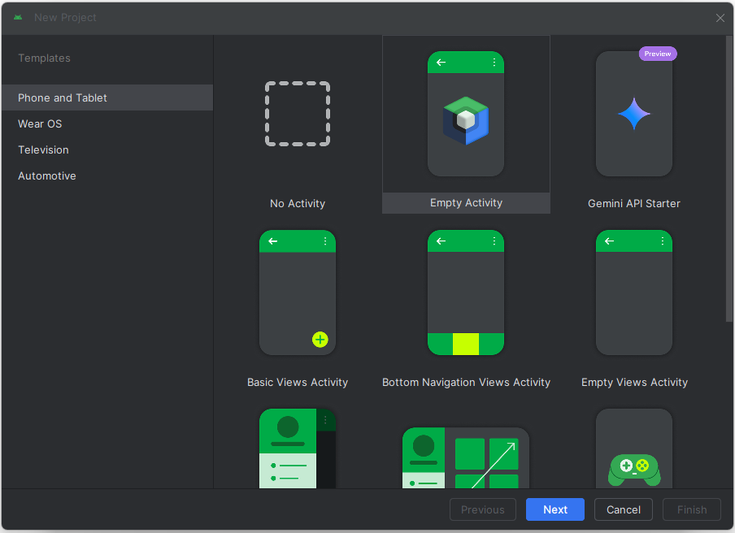
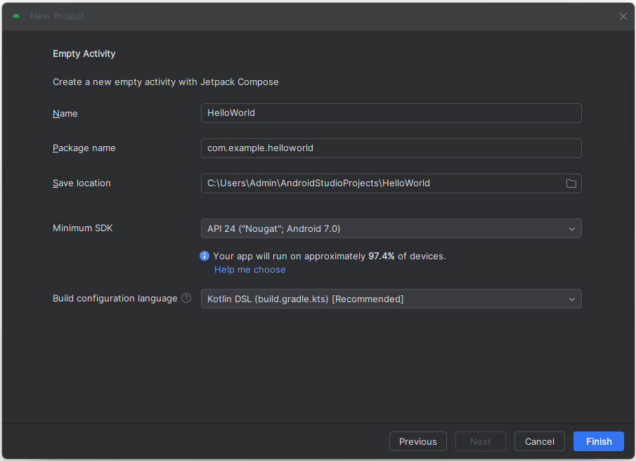
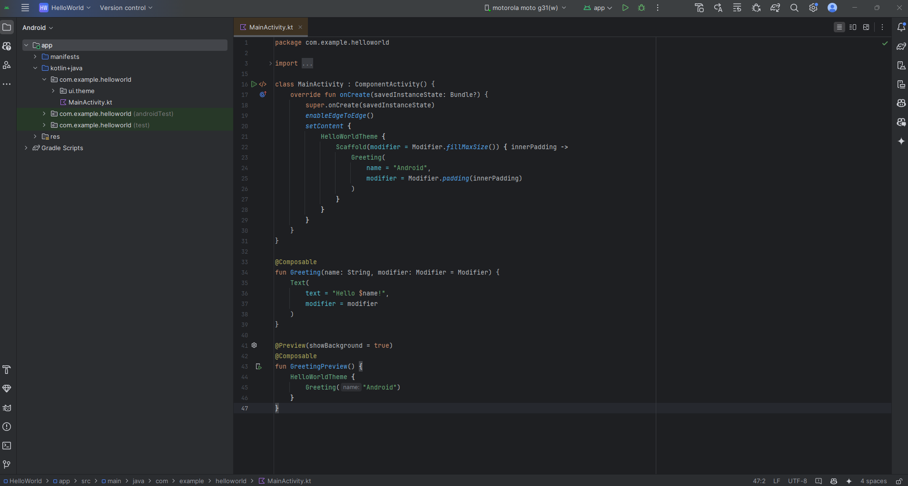
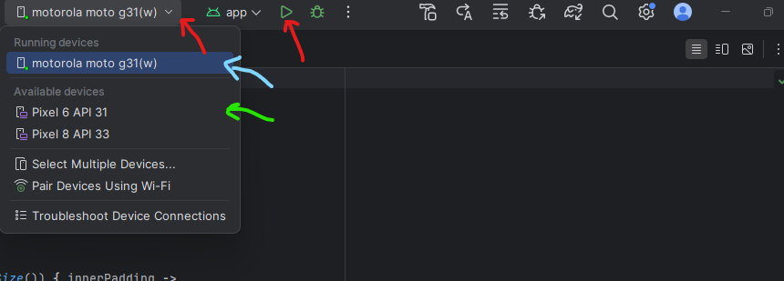

# Install android Studio tutorial
*Author: Vitor Minhoto*

# Instructions (Start Here)

## Step 0: Install Android Studio

Download Android Studio [here](https://developer.android.com/studio) (Should be Android Studio Ladybug). Follow the walkthrough, all default options should be good. Don't touch them unless you know what you're doing.

## Step 1: Create a Project
Now lets create a new project so we can set everything up before the workshop day!

Click **New Project**

Click **Empty Activity** and **Next**

Change name to **Hello World** and click **Finish** 

Wait a bit for the project to set up (might take a few minutes). The final result should look something like the following image.

## Step 2: Run the Hello World app

On the dropdown you have access to both an Android simulated by Android Studio (green arrow) and a physical device (blue arrow) if you connect one to your computer. I recommend you use a physical device if your computer is not very good. Press Run (Red Arrow)

Click **Run App**. The result should look something like the following image.

Looks a bit ugly right? We will fix it on Saturday!

## Step 3: Give yourself a Pat on the Back

Yahoo, you've sucessfully installed Android Studio and run your first application! You are now setup for the workshop tomorrow! 

If you were not able to complete any of the previous steps, please be on LCD a bit earlier tomorrow and I will help you finish the set up!
